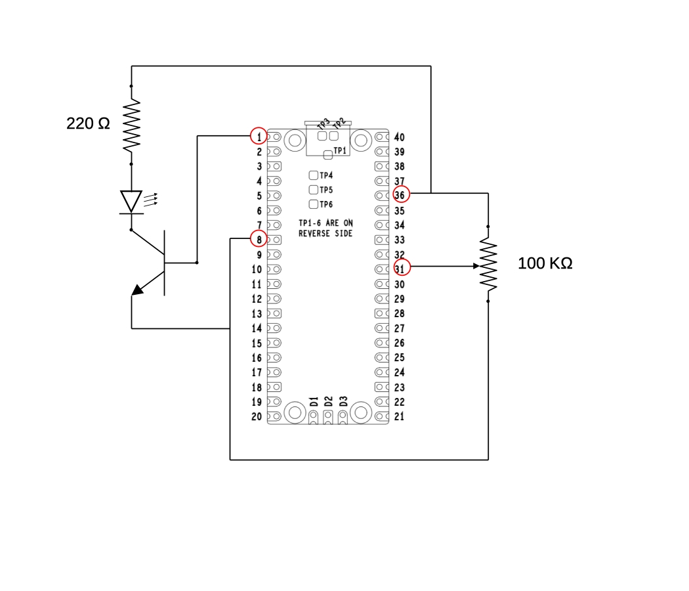

# MICROPYTHON PWM LED

## project description

The circuit consists of the rpi-pico, a potentiometer, a transistor, some resistors and an LED.

The potentiometer (pot) acts a voltage divider from Vcc (3.3 v) to ground, its value is read by the ADC, and the value is used to drive the LED via PWM.

As stated in the main readme file, the scope of this project is to give a starting point and honts for setting up a development environment independent from the IDE (dependency is just for stubs and autocompletion/check, but not for actual programming)

## Schematic

